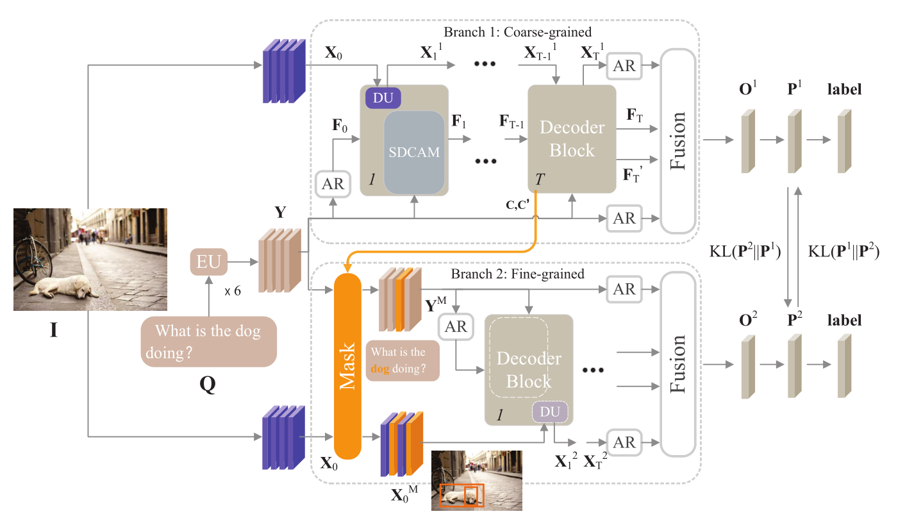

# Dual Capsule Attention Mask Network (DCAMN)

This repository corresponds to the **PyTorch** implementation of the DCAMN for VQA

By using [grid features](https://openaccess.thecvf.com/content_CVPR_2020/html/Jiang_In_Defense_of_Grid_Features_for_Visual_Question_Answering_CVPR_2020_paper.html), DCAMN delivers **73.67%** overall accuracy on the *test-dev* split of *VQA-v2* dataset, which significantly outperform existing state-of-the-arts. 

see our paper for more details.



## Explanation 

Our model is based on MCAN and TRAR, and the data preparation and running environment, etc. are described in [MCAN](/DCAMN-VQA-mcan/README.md) and [TRAR](/DCAMN-VQA-trar/README.md), respectively.

## DCAMN-mcan
Running the following script will train and test the DCAMN with MCAN as the backbone.
### Training on the *train* set.

Train DCAMN-mcan on VQA 2.0 *train* split:

    $ cd DCAMN-VQA-mcan
    $ python run.py --RUN train --SPLIT train --MODEL large --GPU 0,1 --MAX_EPOCH 16

Offline evaluate on VQA 2.0 *val* split:

    $ cd DCAMN-VQA-mcan
    $ python run.py --RUN val --SPLIT train --MODEL large --GPU 0,1 --CKPT_V yourcheckpointversion --CKPT_E 16

### Training with more data.

Train DCAMN-mcan on *train* and *val* splits of VQA 2.0 with data augmentation by a subset of Visual Genome dataset:

    $ cd DCAMN-VQA-mcan
    $ python run.py --RUN train --SPLIT train+val+vg --MODEL large --GPU 0,1 --MAX_EPOCH 16

Online evaluations of both the VQA 2.0 *test-dev* and *test-std* splits are run as follows:

    $ cd DCAMN-VQA-mcan
    $ python run.py --RUN test --SPLIT train+val+vg --MODEL large --GPU 0,1 --CKPT_V yourcheckpointversion --CKPT_E 16


Result files are stored in ```results/result_test/result_run_<'PATH+random number' or 'VERSION+EPOCH'>.json```

You can upload the obtained result json file to [Eval AI](https://evalai.cloudcv.org/web/challenges/challenge-page/163/overview) to evaluate the scores on *test-dev* and *test-std* splits.

## DCAMN-trar
Running the following script will train and test the DCAMN with TRAR as the backbone.
### Training on the *train* set.

Train DCAMN-trar on VQA 2.0 *train* split:

    $ cd DCAMN-VQA-trar
    $ python run.py --RUN train --SPLIT train --DATASET vqa --MODEL trar --GPU 0

Offline evaluate on VQA 2.0 *val* split:

    $ cd DCAMN-VQA-trar
    $ python run.py --RUN val --SPLIT train --DATASET vqa --MODEL trar --GPU 0 --CKPT_V yourcheckpointversion --CKPT_E 16

### Training with more data.

Train DCAMN-trar on *train* and *val* splits of VQA 2.0 with data augmentation by a subset of Visual Genome dataset:

    $ cd DCAMN-VQA-trar
    $ python run.py --RUN train --SPLIT train+val+vg --DATASET vqa --MODEL trar --GPU 0

Online evaluations of both the VQA 2.0 *test-dev* and *test-std* splits are run as follows:

    $ cd DCAMN-VQA-trar
    $ python run.py --RUN test --SPLIT train+val+vg --DATASET vqa --MODEL trar --GPU 0 --CKPT_V yourcheckpointversion --CKPT_E 16


Result files are stored in ```results/result_test/result_run_<'PATH+random number' or 'VERSION+EPOCH'>.json```

You can upload the obtained result json file to [Eval AI](https://evalai.cloudcv.org/web/challenges/challenge-page/163/overview) to evaluate the scores on *test-dev* and *test-std* splits.

### Training with grid feature.

If you want to train DCAMN-trar by using `16 × 16` grid features of images, then you need to generate the features as required by [DATA.md](/DCAMN-VQA-trar/DATA.md) and modify three places:

1. Change *IMG_SCALE* from 8 to 16 in line 15 of [trar.yml](/DCAMN-VQA-trar/configs/vqa/trar.yml).
2. Change *FRCN_FEAT_SIZE* from (64, 2048) to (256, 2048) in line 83 of [base_cfgs.py](/DCAMN-VQA-trar/openvqa/core/base_cfgs.py).
3. Change the path of *self.FEATS_PATH* in line 29 of [path_cfgs.py](/DCAMN-VQA-trar/openvqa/core/path_cfgs.py) to the path of the `16 × 16` grid features which you generated.

Then start training:

    $ cd DCAMN-VQA-trar
    $ python run.py --RUN train --SPLIT train+val+vg --DATASET vqa --MODEL trar --GPU 0,1 --ACCU 4

Online evaluations of both the VQA 2.0 *test-dev* and *test-std* splits are run as follows:

    $ cd DCAMN-VQA-trar
    $ python run.py --RUN test --SPLIT train+val+vg --DATASET vqa --MODEL trar --GPU 0,1 --CKPT_V yourcheckpointversion --CKPT_E 16

Generate a json file and submit it to the site for testing.

## Attention accuracy

We use the VQS dataset of [Vqs: Linking segmentations to questions and answers for supervised attention in vqa and question-focused semantic segmentation](https://openaccess.thecvf.com/content_iccv_2017/html/Gan_VQS_Linking_Segmentations_ICCV_2017_paper.html) to calculate the attention accuracy of DCAMN. For an image, we extract the coupling coefficients in SDCAM as the attention weights of the corresponding bounding boxes, select the 1 to 3 bounding boxes with the largest coefficients, generate a `640 × 640` all-zero tensor, set the tensor's values of the corresponding positions of these bounding boxes to 1, and then calculate the average Intersection of Union (IOU) between the generated attention mask map and the attention map annotated in the VQS dataset. Finally, this IOU is the attention accuracy of our DCAMN.

1. First you need to download the VQS dataset(https://github.com/Cold-Winter/vqs).

2. Unpack the val_ground of VQS into the folder [dataset](/DCAMN-VQA-mcan/datasets).

3. The VQS.json in the folder [vqa](/DCAMN-VQA-mcan/datasets/vqa) is a mapping of questions to image ids.

Finally, the `datasets` folders will have the following structure:

```angular2html
|-- datasets
	|-- coco_extract
	|  |-- train2014
	|  |  |-- COCO_train2014_...jpg.npz
	|  |  |-- ...
	|  |-- val2014
	|  |  |-- COCO_val2014_...jpg.npz
	|  |  |-- ...
	|  |-- test2015
	|  |  |-- COCO_test2015_...jpg.npz
	|  |  |-- ...
	|-- val_ground
	|  |-- COCO_val2014_000000000074.jpg_1.mat
	|  |-- COCO_val2014_000000000074.jpg_2.mat
	|  |-- COCO_val2014_000000000074.jpg_3.mat
	|  |-- ...
	|-- vqa
	|  |-- v2_OpenEnded_mscoco_train2014_questions.json
	|  |-- v2_OpenEnded_mscoco_val2014_questions.json
	|  |-- v2_OpenEnded_mscoco_test2015_questions.json
	|  |-- v2_OpenEnded_mscoco_test-dev2015_questions.json
	|  |-- v2_mscoco_train2014_annotations.json
	|  |-- v2_mscoco_val2014_annotations.json
	|  |-- VG_questions.json
	|  |-- VG_annotations.json
	|  |-- VQS.json

```
Run the following script to calculate the IOU(B=AU):

    $ cd DCAMN-VQA-mcan
    $ python run_ground.py --RUN val --SPLIT train --MODEL large --GPU 0,1 --CKPT_V str --CKPT_E int
